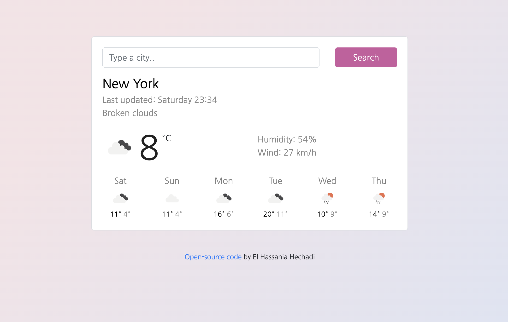

# Weather App

This is a simple weather web app that allows users to search for the current weather and a 6-day forecast for a specific city.



## Features

- Displays current temperature, description, humidity, and wind speed for the searched city.
- Shows the weather forecast for the next 6 days including temperature highs and lows.
- Automatically updates the weather information when a city is searched.
- Responsive design for a better user experience on different devices.

## Technologies Used

- HTML
- CSS (Bootstrap)
- JavaScript (ES6)
- Axios for making HTTP requests to the OpenWeatherMap API

## Installation

1. Clone the repository:

```bash
git clone <https://github.com/hechadielhassania/vanilla-weather>
```

2. Open index.html in your web browser.

3. Start searching for cities and check the weather!


## API Usage
This app uses the OpenWeatherMap API to fetch weather data. You will need to sign up for an API key at OpenWeatherMap and replace the apiKey variable in app.mjs and forcast,mjs with your own API key.

## Credits
This app is based on the Vanilla Weather App project by El Hassania Hechadi. The source code can be found here.

##
Feel free to customize it further according to your project's specific details and requirements.
